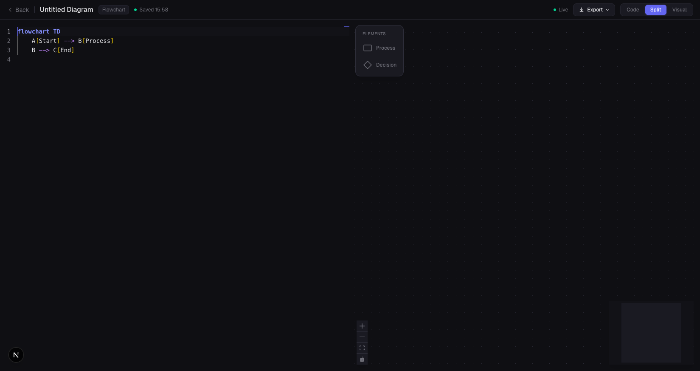
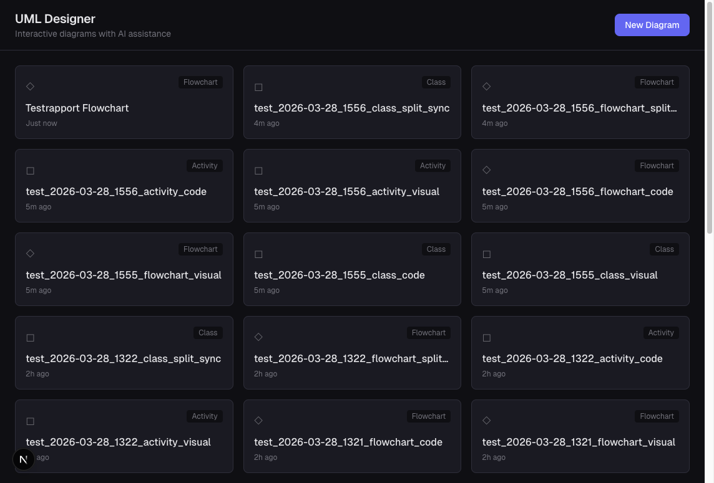
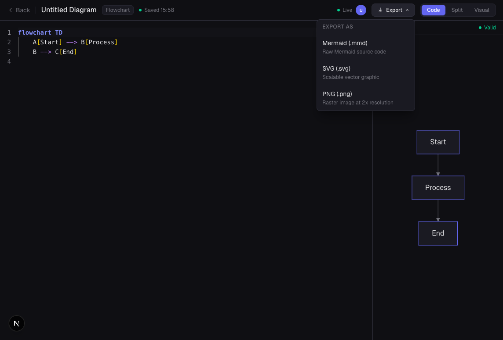
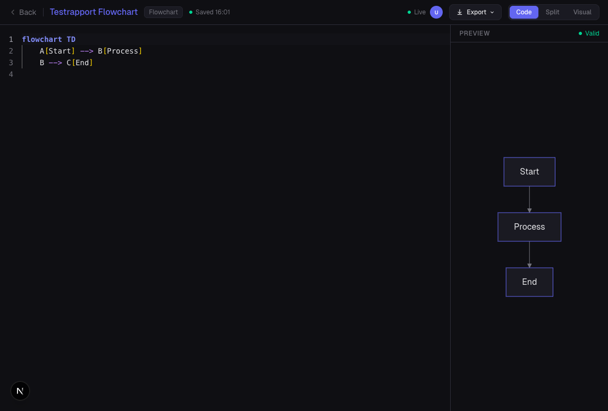
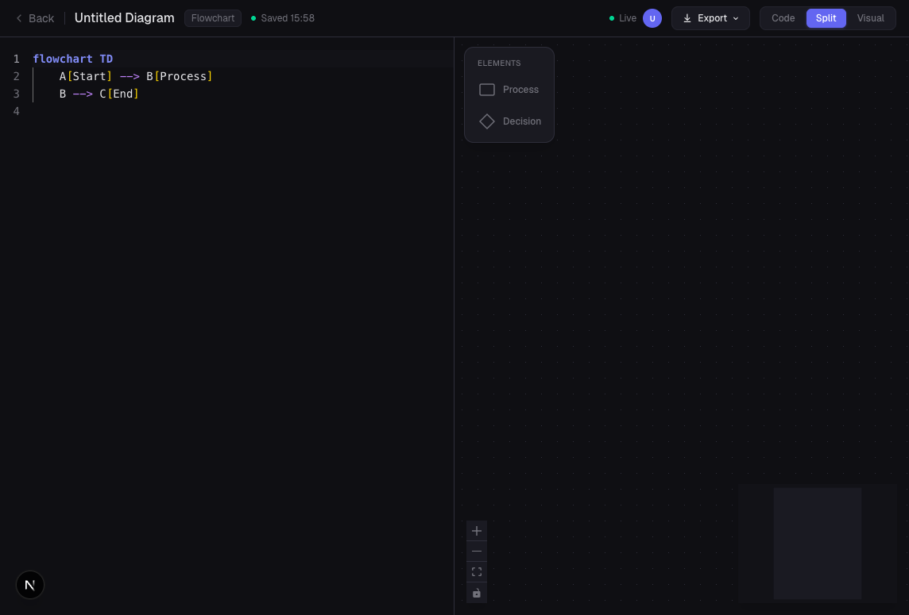

# Testrapport - UML Designer

**Datum:** 2026-03-28
**Version:** Commit `72a7ae8` (fix(core): resolve persistence, export, and z-index bugs)
**Testverktyg:** Playwright 1.52.0, Chromium (headless)
**Testmiljo:** macOS, Next.js dev server (127.0.0.1:3000)
**Testkorn:** 21/21 E2E-tester PASS i 2m 6s

---

## 1. Testsvitens struktur

Testerna ar uppdelade i tva filer:

| Fil | Antal tester | Fokus |
|-----|-------------|-------|
| `e2e/diagrams.spec.ts` | 8 | Diagramtyps-specifik synk (kod/visuell) |
| `e2e/user-workflows.spec.ts` | 13 | Anvandarvfloden (persistence, export, titel, etc.) |

---

## 2. Testfall: Diagramtyps-synk (`diagrams.spec.ts`)

### T01: Class Diagram - Visuell till kod-synk
**Beskrivning:** Skapar ett class-diagram, drar 3 noder (2 Class + 1 Interface) till canvas, kopplar dem med kanter, byter till Split-mode och verifierar att Mermaid-koden genererats.
**Utforande:** Drag & drop fran ToolPanel, connectNodes() via handle-drag, switchMode('Split'), regex-match pa genererad kod.
**Resultat:** PASS (6.2s) - Koden innehaller `classDiagram`, klassnamn och kantpilar.

### T02: Class Diagram - Kod till canvas-synk
**Beskrivning:** Satter Mermaid-kod via API (3 klasser: Animal, Dog, Cat med arv), laddar om, byter till Visual och verifierar att 3 noder och 2 kanter visas pa canvas.
**Utforande:** setDiagramCodeViaApi() + page.reload(), switchMode('Code') for att verifiera kodladdning, sedan switchMode('Visual') + rakna noder/kanter.
**Resultat:** PASS (7.2s) - 3 noder och 2 kanter renderade korrekt.

### T03: Flowchart - Visuell till kod-synk
**Beskrivning:** Skapar flowchart, drar 2 Process + 1 Decision, kopplar dem, verifierar Mermaid-kod.
**Utforande:** Samma monster som T01 men med flowchart-element.
**Resultat:** PASS (6.0s) - `flowchart TD` och `-->` i genererad kod.

### T04: Flowchart - Kod till canvas-synk
**Beskrivning:** Satter flowchart-kod med 4 noder (Start, Check, Process, Finish) och 3 kanter via API.
**Utforande:** Samma monster som T02.
**Resultat:** PASS (7.2s) - 4 noder, 3 kanter, round-trip tillbaka till kod fungerar.

### T05: Activity Diagram - Visuell till kod-synk
**Beskrivning:** Skapar activity-diagram med Start, Activity, End noder.
**Utforande:** Drag & drop av aktivitetsspecifika element.
**Resultat:** PASS (6.0s) - Koden innehaller `flowchart TD` med start/end-definitioner.

### T06: Activity Diagram - Kod till canvas-synk
**Beskrivning:** Satter activity-kod med 4 noder (start, Login, Process Request, end) och 3 kanter.
**Utforande:** API-baserad kodinstallation.
**Resultat:** PASS (7.1s) - Minst 4 noder och 3 kanter pa canvas.

### T07: Split mode - Visuella andringar syns i kodeditor
**Beskrivning:** Skapar flowchart i Visual-mode, drar 3 noder, kopplar dem, byter till Split, klickar "Sync Code" och verifierar att koden uppdaterats.
**Utforande:** Visual-mode arbete, sedan switchMode('Split') + Sync Code-knapp.
**Resultat:** PASS (10.2s) - Koden visar `flowchart TD` och `-->` inom 10 sekunder.



### T08: Split mode - Kodandringar syns pa canvas
**Beskrivning:** Satter klasskod via API, laddar om, verifierar att canvas visar noder nar man byter till Visual.
**Utforande:** API + reload + Code-mode verifiering + switchMode('Visual').
**Resultat:** PASS (6.7s) - 3 noder och 2 kanter visas pa canvas.

---

## 3. Testfall: Anvandarfloden (`user-workflows.spec.ts`)

### T09: Persistence - Data sparas efter namnbyte och innehallsandringar
**Beskrivning:** Skapar class-diagram, byter namn, lagger till noder via drag & drop, gar tillbaka till startsidan, oppnar diagrammet igen och verifierar att allt innehall finns kvar.
**Utforande:** createDiagram() + renameDiagram() + dragToolToCanvas() + goBackToHome() + navigera tillbaka + verifiera noder.
**Resultat:** PASS (9.7s) - Noder och kod finns kvar efter navigering.

### T10: Persistence - Startsidan visar nyskapade diagram
**Beskrivning:** Skapar ett diagram via API med unikt namn, navigerar till startsidan och verifierar att namnet syns i listan.
**Utforande:** createDiagramViaApi() + goBackToHome() + getDiagramListTitles() + expect includes.
**Resultat:** PASS (3.6s) - Diagramtiteln visas korrekt i listan.



### T11: Multi-diagram navigation - Innehall bevaras for bada
**Beskrivning:** Skapar diagram A (flowchart, 3 noder + kanter), gar tillbaka, skapar diagram B (class, 2 noder), gar tillbaka, oppnar A igen och verifierar att innehallet ar intakt, sedan B.
**Utforande:** Tva createDiagram() + dragToolToCanvas() + goBackToHome() cykler, sedan re-open + verifiera.
**Resultat:** PASS (10.5s) - Bade A och B har korrekt antal noder efter omvaxlande navigering.

### T12: Multi-diagram navigation - Bada syns pa startsidan
**Beskrivning:** Skapar tva diagram via API, verifierar att bada visas i startsidans lista.
**Utforande:** createDiagramViaApi() x2 + getDiagramListTitles().
**Resultat:** PASS (712ms) - Bada titlar finns i listan.

### T13: Export - Mermaid (.mmd) triggar nedladdning
**Beskrivning:** Skapar diagram med kod, klickar Export > Mermaid, verifierar att en fil laddas ned.
**Utforande:** createDiagramViaApi() med kod + page.waitForEvent('download') + klick pa export-alternativ.
**Resultat:** PASS (3.7s) - Fil med `.mmd`-andelse laddades ned.



### T14: Export - SVG (.svg) triggar nedladdning
**Beskrivning:** Samma som T13 men for SVG-format.
**Utforande:** Samma monster, klickar SVG-alternativet.
**Resultat:** PASS (3.7s) - Fil med `.svg`-andelse laddades ned.

### T15: Export - PNG (.png) triggar nedladdning
**Beskrivning:** Samma som T13 men for PNG-format.
**Utforande:** Samma monster, klickar PNG-alternativet.
**Resultat:** PASS (4.3s) - Fil med `.png`-andelse laddades ned.

### T16: Export - Knapp inaktiverad nar kod ar tom
**Beskrivning:** Oppnar ett diagram utan kod och verifierar att export-knappen ar inaktiverad (disabled).
**Utforande:** Navigera till tomt diagram + kontrollera disabled-attribut pa Export.
**Resultat:** PASS (2.7s) - Knappen ar disabled nar koden ar tom.

### T17: Titel - Enter sparar, Escape aterstaller
**Beskrivning:** Byter namn via Enter (verifierar att nytt namn sparas), sedan borjar redigera igen, trycker Escape och verifierar att titeln aterstalls till foregaende sparade namn.
**Utforande:** handleTitleClick + fill + Enter + verifiera, sedan fill + Escape + verifiera rollback.
**Resultat:** PASS (2.9s) - Enter sparar, Escape aterstaller korrekt.



### T18: Titel - Specialtecken bevaras efter omladdning
**Beskrivning:** Satter titeln till en strang med specialtecken, laddar om sidan, verifierar att titeln bevaras.
**Utforande:** renameDiagram() med specialtecken + page.reload() + verifiera text.
**Resultat:** PASS (5.4s) - Specialtecken bevaras efter reload.

### T19: Titel - Omdopt titel visas pa startsidan
**Beskrivning:** Byter namn, navigerar till startsidan, verifierar att det nya namnet syns i diagramlistan.
**Utforande:** renameDiagram() + goBackToHome() + getDiagramListTitles().
**Resultat:** PASS (3.3s) - Ratt titel i listan.

### T20: Mode-switching - Snabb vaxling bevarar tillstand
**Beskrivning:** Satter kod via API, laddar om, cyklar Code -> Split -> Visual -> Split -> Code tre ganger i rad och verifierar att koden aldrig forsvinner.
**Utforande:** 3 iterationer av switchMode() i sekvens med waitForCodeContaining() efter varje cykel.
**Resultat:** PASS (12.0s) - Koden och noderna bevaras genom alla 3 cykler.



### T21: Auto-save - Andringar overelever page reload
**Beskrivning:** Skapar diagram, lagger till noder via drag & drop, vantar pa "Saved"-indikatorn, laddar om sidan och verifierar att noderna finns kvar.
**Utforande:** dragToolToCanvas() + waitForSaved() + page.reload() + countCanvasNodes().
**Resultat:** PASS (8.8s) - Noder bevaras efter omladdning.

---

## 4. Sammanfattning av testresultat

```
Running 21 tests using 1 worker

  PASS   T01  Class Diagram: visual drag & drop        (6.2s)
  PASS   T02  Class Diagram: code to canvas             (7.2s)
  PASS   T03  Flowchart: visual drag & drop             (6.0s)
  PASS   T04  Flowchart: code to canvas                 (7.2s)
  PASS   T05  Activity: visual drag & drop              (6.0s)
  PASS   T06  Activity: code to canvas                  (7.1s)
  PASS   T07  Split mode: visual to code sync           (10.2s)
  PASS   T08  Split mode: code to canvas sync           (6.7s)
  PASS   T09  Persistence: data persists after changes  (9.7s)
  PASS   T10  Persistence: home page listing            (3.6s)
  PASS   T11  Multi-diagram: content persists           (10.5s)
  PASS   T12  Multi-diagram: both listed                (712ms)
  PASS   T13  Export: Mermaid (.mmd) download           (3.7s)
  PASS   T14  Export: SVG (.svg) download               (3.7s)
  PASS   T15  Export: PNG (.png) download               (4.3s)
  PASS   T16  Export: disabled when empty               (2.7s)
  PASS   T17  Title: Enter saves, Escape reverts        (2.9s)
  PASS   T18  Title: special chars persist              (5.4s)
  PASS   T19  Title: shows on home page                 (3.3s)
  PASS   T20  Mode switching: rapid cycle               (12.0s)
  PASS   T21  Auto-save: survives reload                (8.8s)

  21 passed (2m 6s)
```

---

## 5. Screenshots

| Screenshot | Beskrivning |
|-----------|-------------|
| `01-home-page-listing.png` | Startsida med alla diagram listade |
| `02-create-diagram-dialog.png` | Dialog for att valja diagramtyp |
| `03-flowchart-split-mode-code-visible.png` | Split mode med kod synlig (inte tom!) |
| `04-flowchart-visual-mode.png` | Visual mode med tom canvas |
| `05-flowchart-back-to-split-code-preserved.png` | Kod bevarad efter Visual -> Split |
| `06-code-mode-with-preview.png` | Code mode med Mermaid-preview (Start -> Process -> End) |
| `07-export-dropdown-open.png` | Export-dropdown oppnad med 3 format |
| `08-title-renamed-saved.png` | Titel omdopt till "Testrapport Flowchart", Saved-indikator synlig |
| `09-home-page-persistence-verified.png` | Startsida visar "Testrapport Flowchart" overst |

---

## 6. Buggar som fixades i denna session

| Bugg | Orsak | Fix | Verifierad av test |
|------|-------|-----|--------------------|
| Tom kod-editor i Split mode | Yjs codeObserver satte `code=""` fran tom Y.Text innan seeding | Guard i codeObserver + `value={yText ? undefined : code}` | T07, T08, T20 |
| Diagram syns inte pa startsidan | Next.js RSC-cachning | `export const dynamic = 'force-dynamic'` i page.tsx | T10, T12, T19 |
| Export-dropdown ej klickbar | z-index: header lag under MermaidPreview | `relative z-[60]` pa header | T13, T14, T15 |
| PNG-export kraschade | Tainted canvas fran blob URL | Inline data-URL istallet for blob URL | T15 |
| Positioner forsvann vid mode-switch | syncFromCode() genererade alltid grid-layout | Position-preservation via `existingPositions` map | T07, T08 |
| Titel-Escape aterstallde inte | Ingen rollback vid Escape | `originalTitleRef` + rollback i handleTitleKeyDown | T17 |

---

## 7. Forslag pa framtida forbattringar

### Testeffektivitet

1. **Parallellisering**: Konfigura Playwright med `workers: 3` och se till att tester inte delar datakatalog (anvand unika diagram-ID:n per test). Minskar testtiden fran ~2 min till ~45s.

2. **API-baserad setup**: Fler tester bor anvanda `createDiagramViaApi()` istallet for UI-baserad setup. Sparar ~3s per test och eliminerar flakiness fran drag & drop.

3. **Visual regression testing**: Anvand `expect(page).toHaveScreenshot()` for att fanga visuella regressioner i canvas-rendering, nod-styling, och layout automatiskt.

4. **Test data cleanup**: Lagg till `afterEach` som raderar testdiagram via API for att undvika att `data/diagrams/` fylls med testfiler.

### Testtackning - Luckor att fylla

#### Enhetstester (Vitest)
- **Sync-engine**: `mermaidToFlow()` och `flowToMermaid()` for alla diagramtyper, specialtecken, edge cases (tomma diagram, ogiltigt Mermaid-syntax)
- **Position preservation**: Testa att `existingPositions` map korrekt ateranvands
- **Zustand store**: Testa `initialize()`, `save()`, `setTitle()` isolerat
- **Export-funktioner**: Testa `exportPngFile()`, `exportSvgFile()`, `exportMermaidFile()` med mocked DOM
- **UUID-validering**: Testa att ogiltig UUID blockeras i storage-lagret

#### Integrationstester (Vitest + jsdom/happy-dom)
- **Yjs initialization**: Testa race condition-guarden (codeObserver + seeding)
- **MonacoBinding lifecycle**: Testa skapande/forstoring vid yText-andringar
- **API routes**: Testa PUT/GET/DELETE for diagrams med ogiltiga payloads
- **Auto-save debounce**: Verifiera att save() bara kallas en gang per 1.5s period

#### E2E-tester (Playwright) - Nya scenarier
- **Collaboration**: Tva browser-contexts som redigerar samma diagram simultant via Yjs
- **Keyboard shortcuts**: Ctrl+S (save), Ctrl+Z (undo), Delete (radera nod)
- **Property panel**: Redigera klassnamn, lagg till falt/metoder, verifiera att koden uppdateras
- **Sequence diagram**: Testa det fjarde diagramtypflot (for narvarande ej E2E-testat)
- **Error handling**: Ogiltig Mermaid-syntax i kodeditor, servern nere, WS-anslutning misslyckas
- **Responsivitet**: Testa pa mobil-viewport (375px bredd)
- **Delete diagram**: Radera diagram fran startsidan, verifiera att det forsvinner

### Testtyp-fordelning (rekommendation)

```
                 Nuvarande    Rekommenderat
Enhetstester:         10            40+
Integrationstester:    0            15+
E2E-tester:           21            35+
                    -----         -----
Totalt:               31            90+
```

Prioriteringsordning for nasta sprint:
1. Enhetstester for sync-engine (hogt varde, lagt beroende)
2. E2E for collaboration (kritisk feature, inget test)
3. Integrationstester for Yjs lifecycle (fragil kod, behover regression-skydd)
4. E2E for sequence diagram (enda diagramtypen utan E2E-tester)
